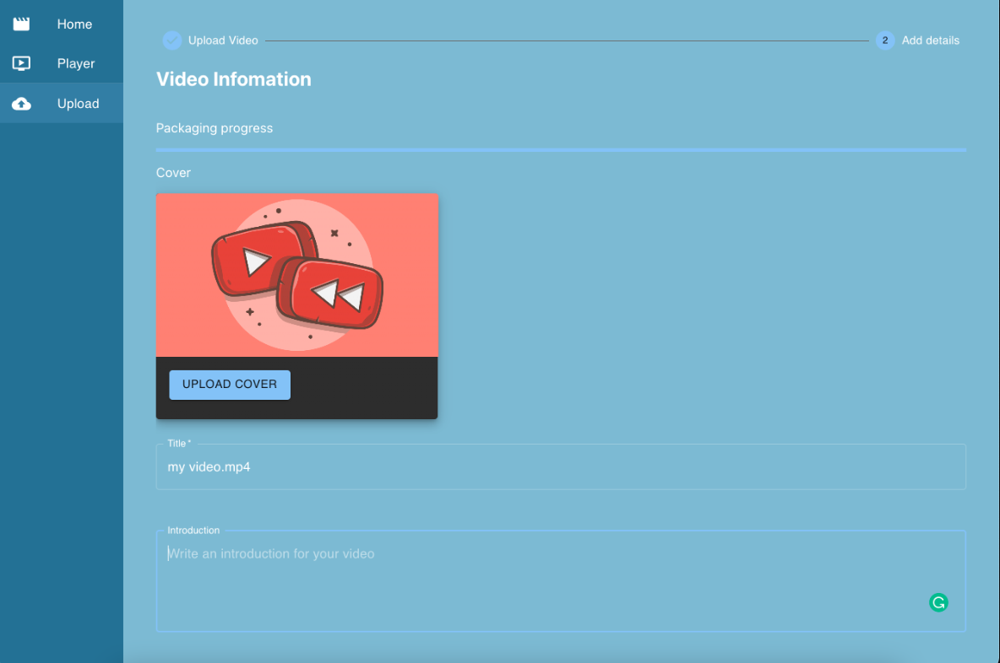
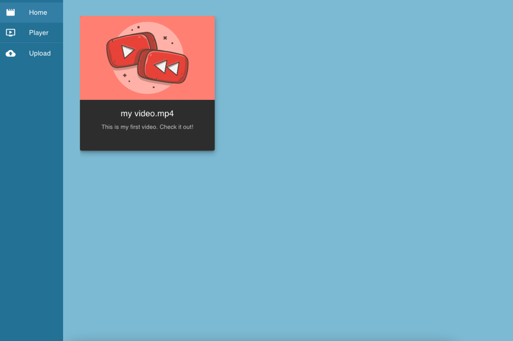
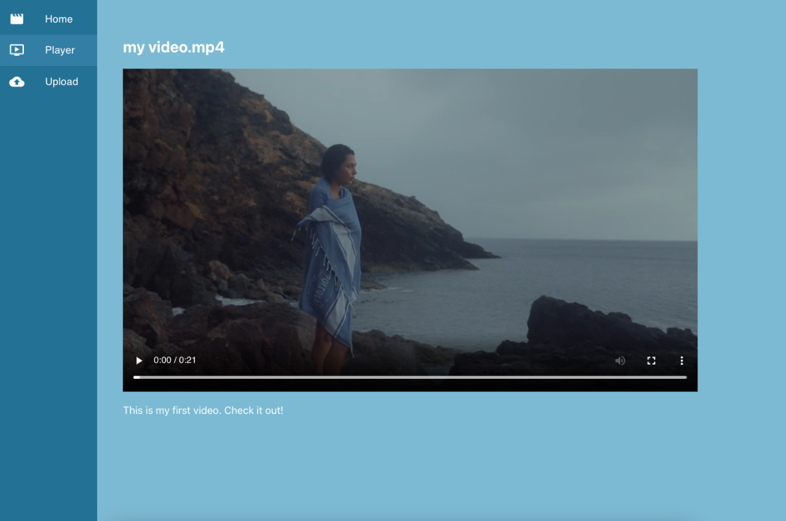
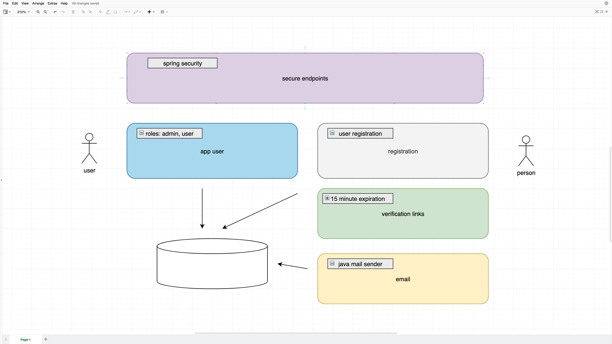
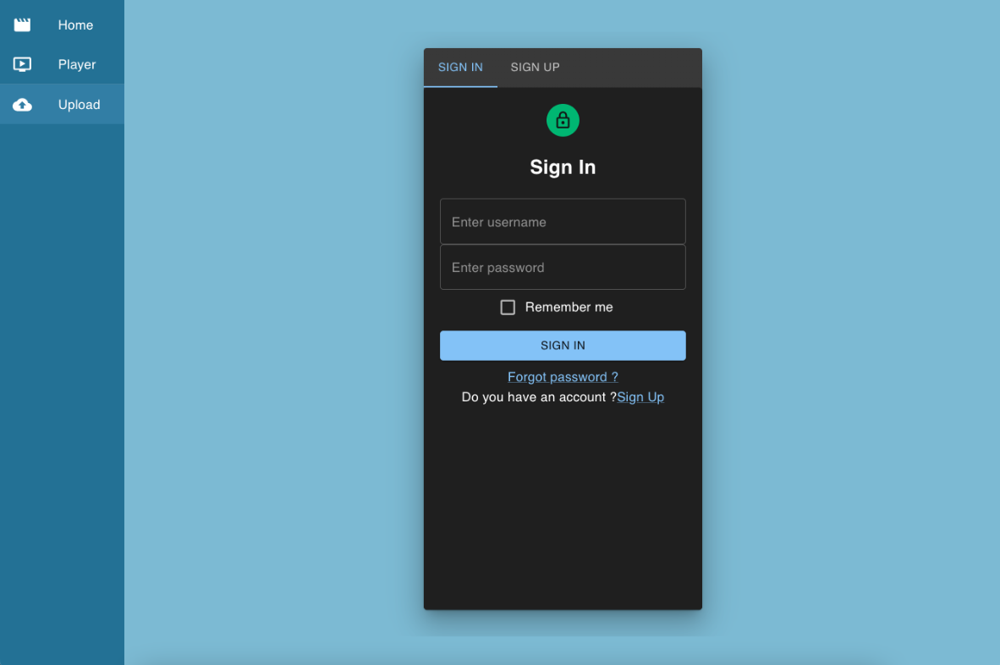
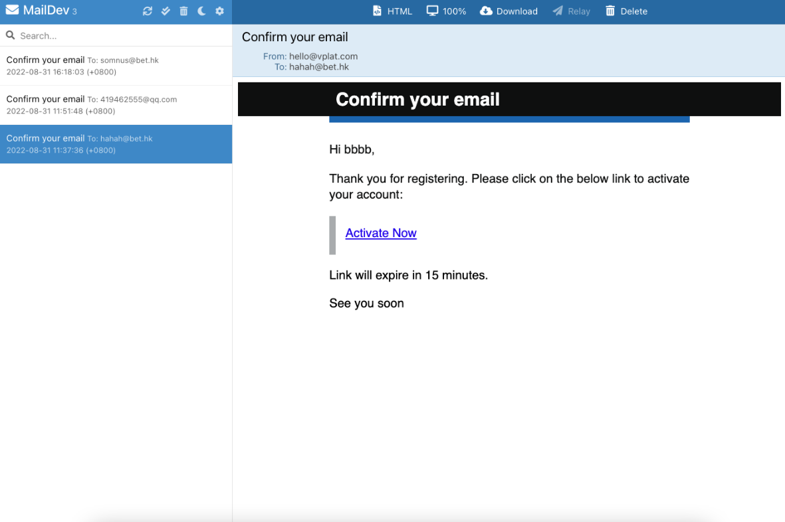

# VideoPlatformBackend

A video platform that users can watch and publish their videos(new features are on the way).

Frontend is a single-page application using React, Redux, and Material UI. You can check the frontend repo in this [link](https://github.com/ziyuen/VideoPlatformFrontend).

Backend is a RESTful service using Spring Boot, Spring Data JPA, MySQL, and Spring Security.
 
## Features： 
- [x] Support uploading large files(merge video chunks)
- [x] Serve static resource(images, videos)
- [x] Login/Register
- [x] Email verification with expiry

## Support uploading large files 


## Serving static resource



## Email verification with expiry




## How to build?
Before you can build the Spring Boot application, you need to create a MySQL and a MailDev instance first. You are recommended to run them in docker. In the project directory, you can simply run
```
docker compose up
```